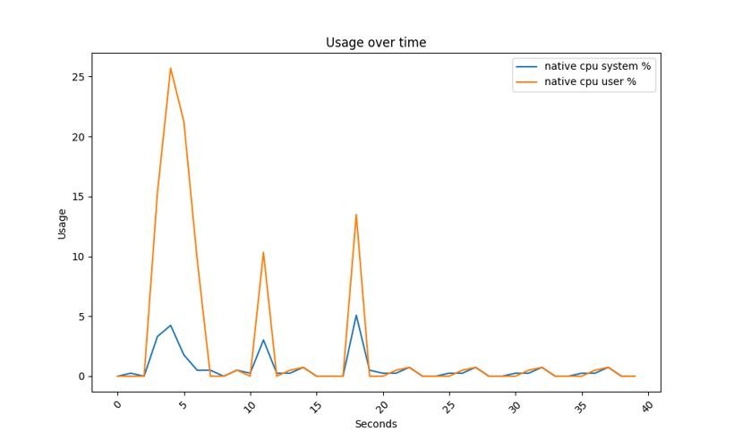
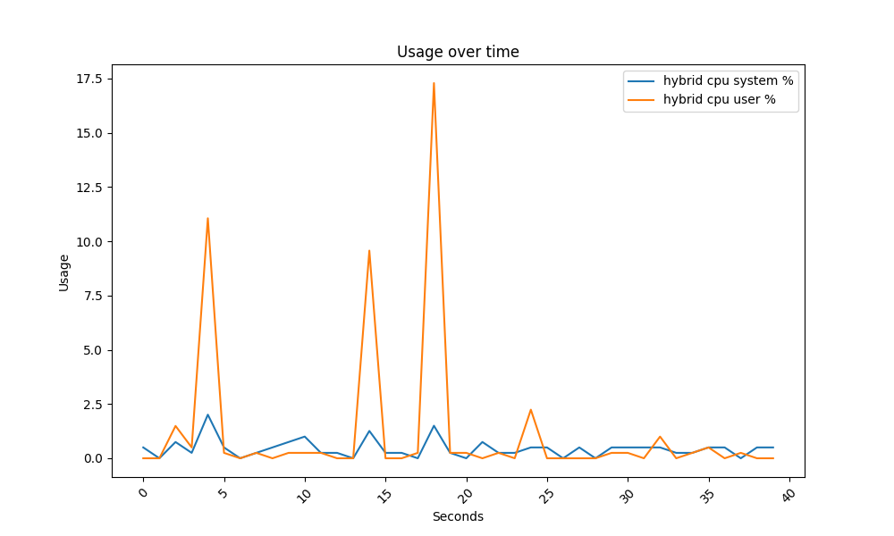
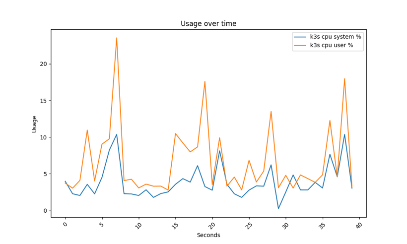
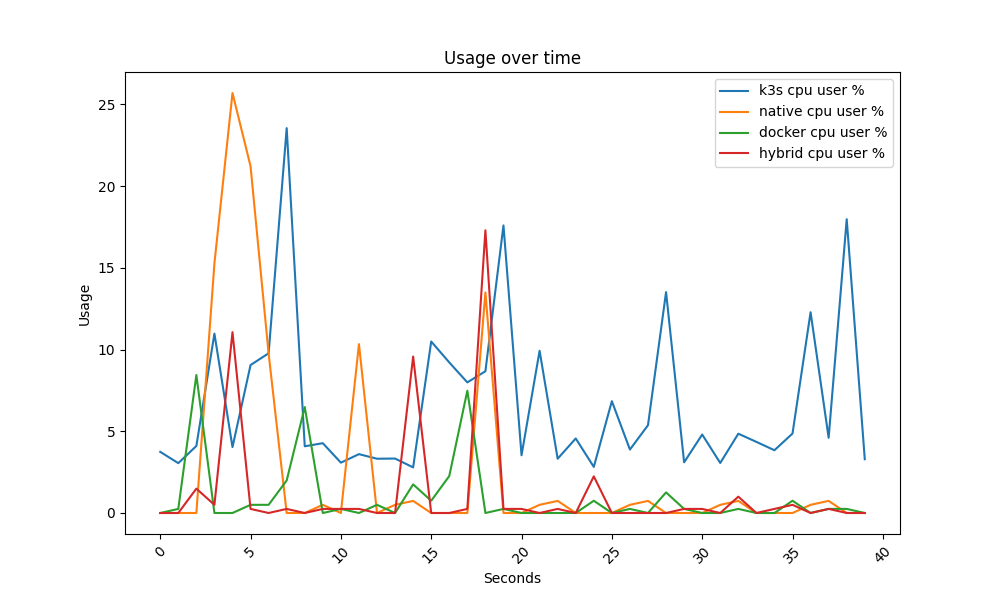
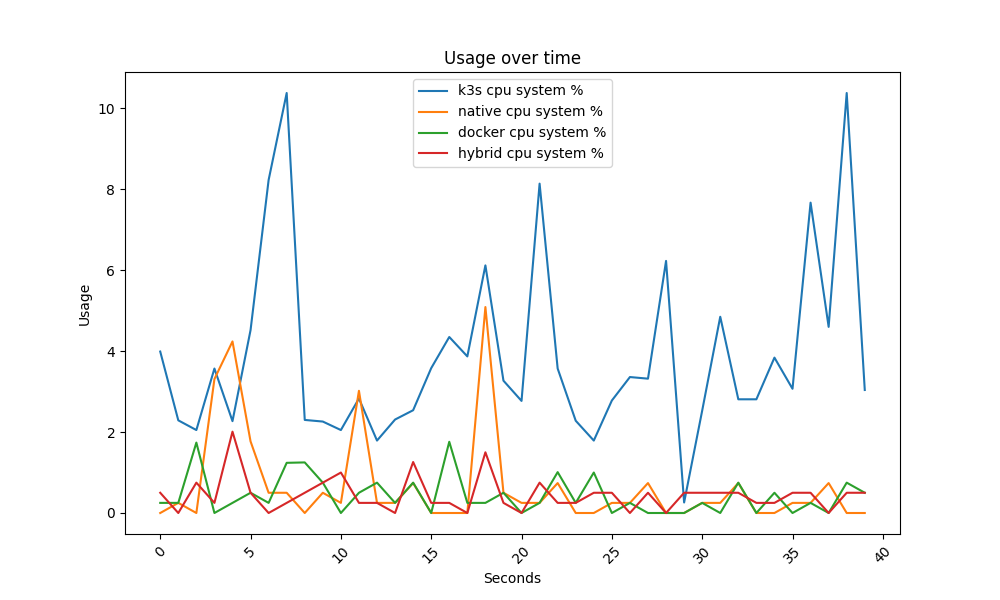
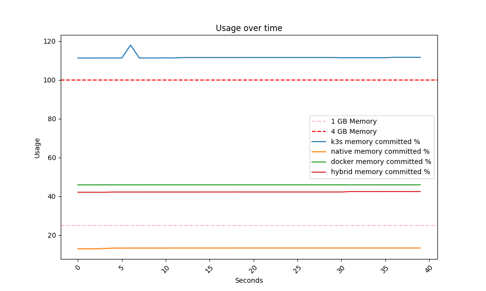
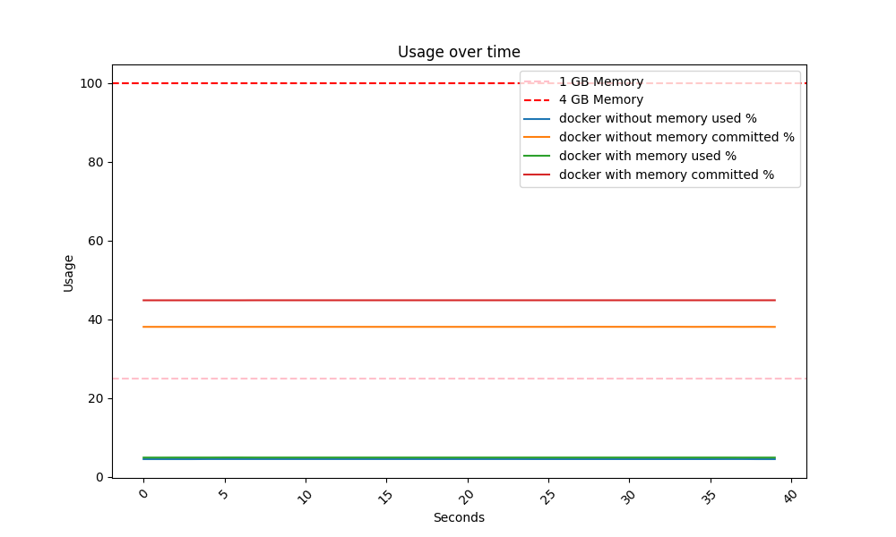
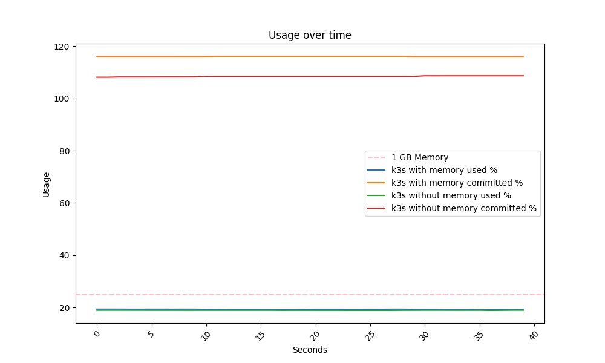

# S16 deployment methods

Modes of deployment for the Raspberry Pi 4b.

---

# Possibilities

- Everything native deployed
- Main application locally deployed, database and otel-collector containerized.
- Everything deployed wia docker using docker compose or docker stack.
- Using Suses Kubernetes implementation K3S.

---

# Test deployment platform

- Raspberry 4b with 4gb Ram.
- Yocto Linux with poky distribution Nanbield branch.
- With several necessary development tools like a ssh server, editor, systat e.g.
- Every deployment method has their own image with the services needed installed

---

# Tested Deployment methods

- Everything natively deployed.
- Main application natively deployed, database and otel-collector containerized.
- Everything deployed wia docker using docker compose or docker stack.
- Using Suses Kubernetes implementation K3S.

---

# Pro/cons of native deployment

## **Pros**

- Resources consumption is minimal.
- Can be updated with Nuget/Linux packages.

## **Cons**

- Has no defined state.
- Updates can break/fail.
- Updating the database could be prone to errors.
- Can only be tested on the deployment platform.

---

# Native deployment CPU usage

---
# Details of hybrid deployment

- Dotnet 8.0.1 package form a third-party Layer.
- Docker from the official Yocto meta-virtualization  layer.
- Docker compose file with postgres and otel-collector container
- Systemd needed for docker.

---

# Pro/cons of hybrid deployment

## **Pros**

- Software stack can be updated with Nuget/Linux packages.
- Setup of postgres database is much easier than in native

## **Cons**

- Has no defined state.
- Updates can break/fail.
- Can only be tested on the deployment platform.

---
# Hybrid deployment CPU usage

---

# Details of docker deployment

- Docker from the official Yocto meta-virtualization  layer.
- Systemd for dependent docker services.
- One Deployment with docker Stack.
- One Deployment with docker compose.
- Both variants have the same resource profile.

---

# Pro/cons of docker deployment

## **Pros**

- Has a defined state.
- Full testing is relatively easy(can be done on Development Computers).
- Deployment Process is easily be automated.

## **Cons**

- Memory consumption, on 1 GB ram is already at limit capacity.
- The process of storing secrets is not very though out.
- Not as many fail saves as Kubernetes

---

# Docker deployment CPU usage

---

# Details of the Kubernetes deployment

- K3s from the official meta-virtualization layer.
- Docker from the official meta-virtualization layer.
- Systemd needed for k3s.
- Some SE-Linux components needed from the official meta-security layer.
- Special startup parameters for Raspberry Pi 4b.

---

# Pro/cons of kubernetes deployment

## **Pros**

- Has a defined state.
- Deployment Process can easily be automated.
- The whole deployment process is very well-thought-out.
- Has many fail-safe mechanisms.
- You could duplicate your application during an update.

## **Cons**

- Committed memory is already over limit capacity on 4gb Ram.
- Many functions of the software is not needed.
- Additional dependency on k3s developer (Suse Inc).

---

# Kubernetes deployment CPU usage

---

# Comparison of CPU usage for user

---

# Comparison of CPU usage for system

---

# Comparison of memory used

---

# Comparison of memory committed

---

## Docker with/without empty container Memory comparision

---

## K3s with/without empty container Memory comparision

---

# My recommendations

- Depends on the device's resources.
- Best developer experience is in my opinion k3s.
- If only 1 GB of ram is available native deployment would be my choice.
- If 2-4 GB of ram is available docker deployment would be my choice.
- If 8 GB of ram is available k3s would be my choice.
