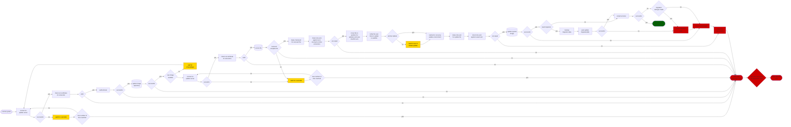

# S16 image update model

```mermaid
flowchart LR
   nSystem([normal system]) 
   nSystem-->connectRepo["connect to 
   update server"]
   connectRepo-->successConnect{successful}
   successConnect-->|yes|checkSSL["check ssl certificate
   of connection"]
   successConnect-->|no|waitConnect[wait for x seconds]:::wait
   waitConnect-->maxTries{"max number of
   tries reached"}
   maxTries-->|no|connectRepo
   maxTries-->|yes|errorLog(["error log/
   message to app"]):::failed
   errorLog-->consent{"has user consented
   for diagnostic data"}:::failed
   consent-->sendDiagData(["send dignostic
   data"]):::failed
   checkSSL-->validSSL{valid}
   validSSL-->|yes|authenticate[authenticate]
   validSSL--> |no|errorLog
   authenticate-->authSuccess{successful}
   authSuccess-->|yes|updateImageRepo[("update image
    repository")]
   authSuccess-->|no|errorLog
  updateImageRepo-->successImageRepo{successful}
  successImageRepo-->|yes|newImage{"new image
  availible"}
  successImageRepo-->|no|errorLog
  newImage-->|no|waitForImage["wait for 
  x hours/days"]:::wait
  waitForImage-->connectRepo
  newImage-->connectUpdate["connect to
  update server"]
  connectUpdate-->successConnectUpdate{sucessful}
  successConnectUpdate-->|yes|checkSSLUpdate["check ssl certificate
  of connection"]
  successConnectUpdate-->|no|waitForImageConnection["wait for x seconds"]:::wait
  waitForImageConnection-->maxTriesImage{"max number of
  tries reached"}
  maxTriesImage-->|yes|errorLog
  maxTriesImage-->|no|connectUpdate
  checkSSLUpdate-->validSSLUpdate{valid}
  validSSLUpdate-->|yes|receiveFile[(receive file)]
  validSSLUpdate-->|no|errorLog  
  receiveFile-->completeFile{"received
  complete file"}
  completeFile-->|yes|makeChecksum["make checksum 
  for recieved file"]
  completeFile-->|no|waitForImageConnection
  completeFile-->|no|errorLog  
  makeChecksum-->checkChecksum["check sha sum
  against sum 
  received at initial
  connection"]
  checkChecksum-->checksumEqual{"are equal"}
  checksumEqual-->|yes|moveFile["move file to
  partition for
  updates and save
  sha256 sum"]
  checksumEqual-->|no|errorLog
  moveFile-->notify["notify the user
  that an update
  is availible"]
  notify-->prioUpdate{priority Update}
  prioUpdate-->|no|waitForUser["wait for user to
  initiate update"]:::wait
  waitForUser-->reboot["reeboot to recovery
  update environment"]
  prioUpdate-->|yes|reboot
  reboot-->makeChecksumReboot["make sha sum
  for update file"]
  makeChecksumReboot-->checkChecksumReboot["check sha sum 
  against saved sum"]
  checkChecksumReboot-->checksumEqualReboot{are equal}
  checksumEqualReboot-->|yes|updateImage[("update system
  image")]
  checksumEqualReboot-->|no|rebootOld["reboot to 
  old system"]:::failed
  updateImage-->successUpdate{successful}
  successUpdate-->|yes|needMigration{need migration}
  successUpdate-->|no|revertUpdates[revert to old image]:::failed
  revertUpdates-->rebootOld
  rebootOld-->errorLog
  needMigration-->|yes|backup["backup 
  migration data"]
  needMigration-->|no|reload
  backup-->pUMigration["post update
  migration(db)"]
  pUMigration-->successMigration{successful}
  successMigration-->|yes|reload[reload services]
  successMigration-->|no|revertMigration["revert migration
  data"]:::failed
  revertMigration-->revertUpdates
  reload-->successReload{successful}
  successReload-->|no|migrationMade{"migration
  cahnges made"}
  migrationMade-->|yes|revertMigration
  migrationMade-->|no|revertUpdates
  successReload-->|yes|endSuccess(["log success/
  message to app"]):::success
  classDef success fill:#006400
  classDef failed fill:#cd0000
  classDef wait fill:#ffd700,color:#000000
```
