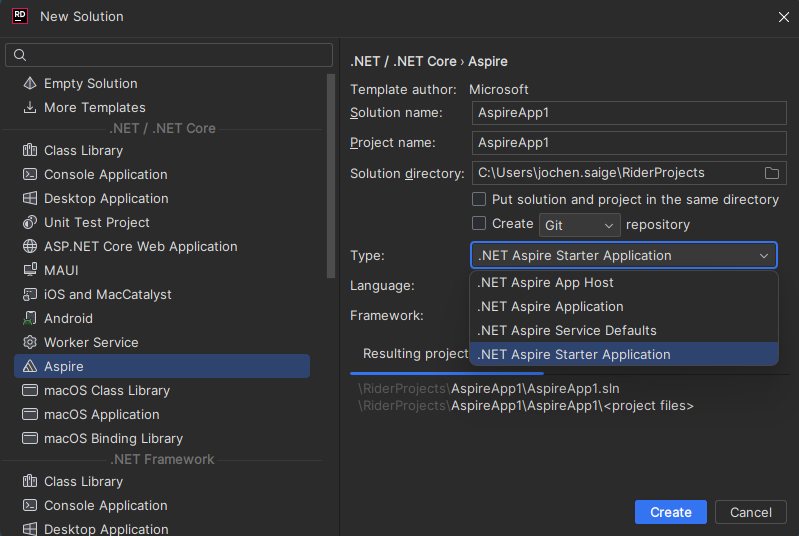
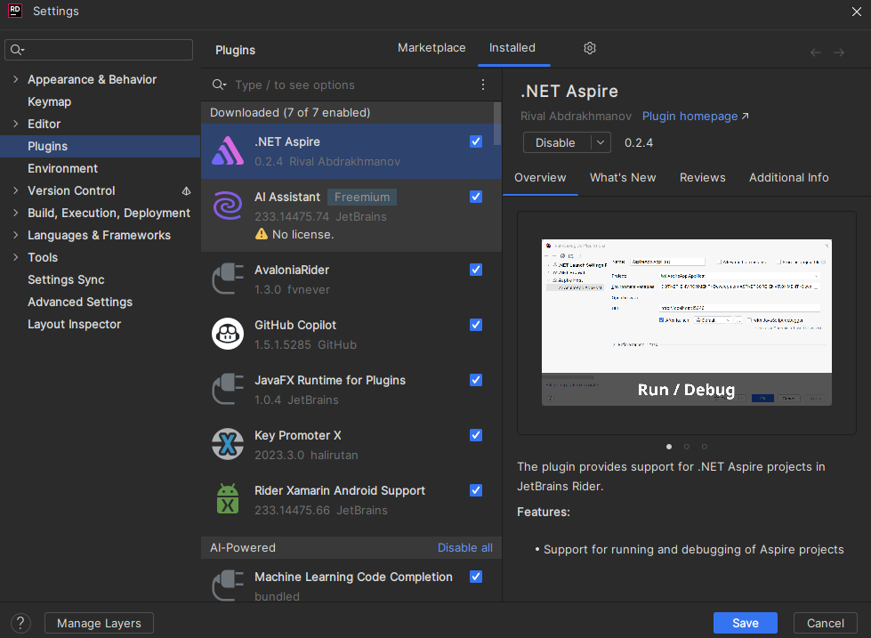

# Orchestrating with .net aspire

## Introductory notes

.net aspire is currently only in preview and could be fundamentally changed or shelved by Microsoft

## Getting Started

## Prerequisites

- [.net 8.0](https://dotnet.microsoft.com/download/dotnet/8.0)
- Container runtime [Docker Desktop](https://www.docker.com/products/docker-desktop/) or [Podman](https://podman.io/docs/installation)

## Visual Studio

If you want the full aspire tooling provided by Microsoft you need to use the [Visual Studio 2022 Preview](https://visualstudio.microsoft.com/de/vs/preview/) version 17.10 or higher.

Under the Visual Studio installer you need to select the .net aspire workload located under "ASP.net an web development".


## Other

The workload installation wia .net CLI is needed for all other editors.

### .net command line client

To install the .net aspire workload you need to use the .NET CLI which is par of the dotnet 8.0 installation.
Then use `dotnet workload update` to ensure you install the latest preview of aspire.
And then install it with `dotnet workload install aspire`.

### VS Studio code

To develop .net aspire under VS Code you need to start a new solution with `dotnet new aspire` for a basic aspire project or
`dotnet new aspire-starter` for the sample inspire project including a sample .net Blazor webUI and a .net core web api project.

Then you can use the solution how you would use a normal .net application.

### Jetbrains Rider

If you install the workloads with the commands above. The workloads should be under .net / .net core templates when you create a new solution there you can select the corresponding templates.



If you want to Run/Debug the .net aspire project you need a third party [plugin form Rival Abdrakhmanov](https://plugins.jetbrains.com/plugin/23289--net-aspire)



## Development

When you started a new solution or added orchestration support to your existing project. There a two aspire specific project in you solution. 

### aspire app host

The aspire app host is for defining you application stack during development. It works similar to a docker compose or kubernetes deployment but is written in C# and has intellisense support.
With the app host it is relatively easy to start a microservice based solution. You can add Container and pass references.
This is a sample application with a postgresql container with a persistent volume and with the PgAdmin ui for easy database management.
It adds then a asp .net web api and a Blazor webui with references to the database and the backend.

```C#
var builder = DistributedApplication.CreateBuilder(args);

var database = builder.AddPostgresContainer("database", password:"mysecretpassword",port:5432)
    .WithPgAdmin()
    .WithVolumeMount("database", "/var/lib/postgresql/data")
    .AddDatabase("streamedaudiobooks");

var backend = builder.AddProject<Projects.StreamedAudioBooksBackend>("StreamedAudiBooksBackend")
    .WithReference(database);

builder.AddProject<Projects.StreamedAudioBooksBlazor>("StreamedAudiBooksFrontend")
    .WithReference(backend);


builder.Build().Run();
```

### aspire service defaults

The aspire service defaults are where opentelemetry, health check, resilience and service discovery options are defined. Since aspire is an opinionated framework it make there many default settings, but if you want to have your personal/team options there you can change everything.

Note if you want to build your container you need to copy the project file you want to build the container and the service defaults project file for the build process.

I noticed that i had problems building the aspire orchestrated project an publish it for arm64 with the default dotnet build container, the `dotnet restore` i ran into a [https://gitlab.com/qemu-project/qemu/-/issues/249](known qemu bug) which the builder uses. So i needed to build inside a arm64 container for it to work but it slows down the building process significantly(from 100 seconds on my windows 11 machine to 300+ seconds).

Sample Dockerfile for an aspire project for arm64

```
FROM mcr.microsoft.com/dotnet/aspnet:8.0-cbl-mariner2.0-arm64v8 AS base
USER $APP_UID
WORKDIR /app
EXPOSE 5001

FROM mcr.microsoft.com/dotnet/sdk:8.0-cbl-mariner2.0-arm64v8 AS build
ARG BUILD_CONFIGURATION=Release
WORKDIR /src
COPY ["EltakoSoftwareDeploymentMonitorApi/EltakoSoftwareDeploymentMonitorApi.csproj", "EltakoSoftwareDeploymentMonitorApi/"]
COPY ["EltakoSoftwareDeploymentMonitorApi.ServiceDefaults/EltakoSoftwareDeploymentMonitorApi.ServiceDefaults.csproj", "EltakoSoftwareDeploymentMonitorApi.ServiceDefaults/"]
RUN dotnet restore "EltakoSoftwareDeploymentMonitorApi/EltakoSoftwareDeploymentMonitorApi.csproj"
COPY . .
WORKDIR "/src/EltakoSoftwareDeploymentMonitorApi"
RUN dotnet build --runtime linux-arm64 "EltakoSoftwareDeploymentMonitorApi.csproj" -c $BUILD_CONFIGURATION -o /app/build

FROM build AS publish
ARG BUILD_CONFIGURATION=Release
RUN dotnet publish --runtime linux-arm64 "EltakoSoftwareDeploymentMonitorApi.csproj" -c $BUILD_CONFIGURATION -o /app/publish /p:UseAppHost=false

FROM base AS final
WORKDIR /app
COPY --from=publish /app/publish .

COPY EltakoSoftwareDeploymentMonitorApi/wait-for-postgres.sh /wait-for-postgres.sh

# Use the script as an entrypoint
ENTRYPOINT ["/wait-for-postgres.sh"]
```

### aspire dashboard


The aspire dashboard is in my opinion the highlight of the development process with .net aspire because it functions as your opentelemetry collector in your development process and has a structured logging section which integrates logging with the traces and metrics so that you can better find errors for component overlapping processes. It is currently in the process to be separated from aspire and to become available for general use. There is a docker container:
```
docker run --rm -it \
  -p 18888:18888 \
  -p 4317:18889 \
  -d --name aspire-dashboard \
  mcr.microsoft.com/dotnet/nightly/aspire-dashboard:8.0.0-preview.4
```
but it is very unstable at the moment.

### aspire components


Aspire components are nuget packages specially developed for an aspire orchestrated application, it helps you to add certain components like databases, orms, caching, Azure services among others to your application. The components make it easier to integrate these services because they add your configuration options from your service default project to these components and make things like database migrations in the Microsoft entity framework automatically. Currently(as of 03.04.24) the selection of aspire components is limited to services which are very often used and Azure components.

For example this line is all that is needed to integrate your entity framework connection with your aspire solution with your service default configuration and database migration:

```
builder.AddNpgsqlDbContext<EltakoSoftwareDeploymentMonitorDbContext>("database",
                         settings => settings.ConnectionString = $"Host={builder.Configuration["POSTGRES_HOST"]};Password=Dlq7oHLBqI;Username=postgres;Database=esdm;");
```

### Publishing your application outside of Azure

Currently the aspire framework works best with Microsoft Azure cloud services, which have tooling to publish your aspire solution to the Azure cloud.
But the framework is build independently from Azure so in the future other cloud services could replicate these tooling for there respected services.
The aspire framework can generate you a deployment manifest, which other tools can use to deploy your aspire solution.
```
dotnet run --project AspireApp.AppHost\AspireApp.AppHost.csproj `
    -- `
    --publisher manifest `
    --output-path ../aspire-manifest.json
```
If you want to generate a kubernetes configure from this manifest, there is a tool called [Aspirate (Aspir8)](https://github.com/prom3theu5/aspirational-manifests) which automates this process you only need to run these two commands:
`aspirate generate` for generating the configuration files and `aspirate build` to build the respective containers.
It currently also supports generating a docker compose deployment with `aspirate generate --output-format compose`, but the docker compose deployment isn't as 
fully developed as the kubernetes deployment and requires a lot of fine tuning to get a working deployment.

